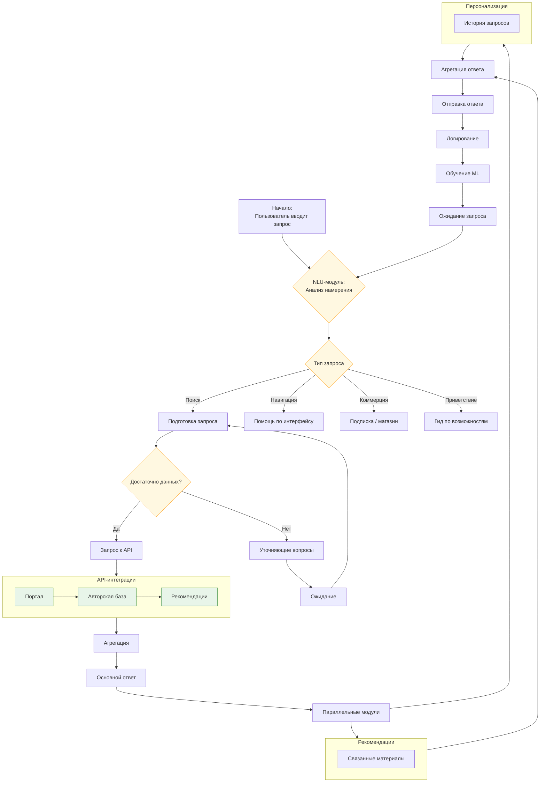

```mermaid
flowchart TD
    A[Начало:<br>Пользователь вводит запрос] --> B{NLU-модуль:<br>Анализ намерения}
    B --> C{Тип запроса}
    C -->|Поиск| D[Подготовка запроса]
    C -->|Навигация| E[Помощь по интерфейсу]
    C -->|Коммерция| F[Подписка / магазин]
    C -->|Приветствие| G[Гид по возможностям]
    
    D --> H{Достаточно данных?}
    H -->|Нет| I[Уточняющие вопросы] --> J[Ожидание] --> D
    H -->|Да| K[Запрос к API]
    
    subgraph K1 [API-интеграции]
        K1_1[Портал] --> K1_2[Авторская база] --> K1_3[Рекомендации]
    end
    
    K --> K1 --> L[Агрегация] --> M[Основной ответ]
    M --> N[Параллельные модули]
    
    subgraph N1 [Рекомендации]
        N1_1[Связанные материалы]
    end
    
    subgraph N2 [Персонализация]
        N2_1[История запросов]
    end
    
    N --> N1 & N2 --> O[Агрегация ответа]
    O --> P[Отправка ответа] --> Q[Логирование]
    Q --> R[Обучение ML] --> S[Ожидание запроса]
    S --> B
    
    %% Стили
    classDef decision fill:#fff8e1,stroke:#ff9800
    classDef api fill:#e8f5e9,stroke:#388e3c
    class B,C,H decision
    class K1_1,K1_2,K1_3 api
```
