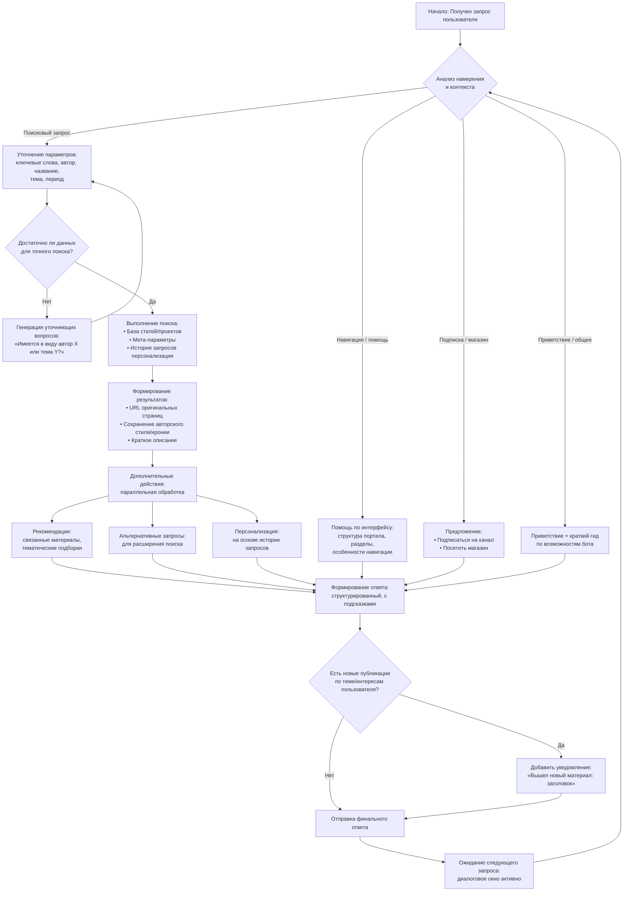

```mermaid
flowchart TD
    A[Начало: Получен запрос пользователя] --> B{Анализ намерения<br>и контекста}
    
    B -->|Поисковый запрос| C[Уточнение параметров:<br>ключевые слова, автор, название,<br>тема, период]
    B -->|Навигация / помощь| D[Помощь по интерфейсу:<br>структура портала, разделы,<br>особенности навигации]
    B -->|Подписка / магазин| E[Предложение:<br>• Подписаться на канал<br>• Посетить магазин]
    B -->|Приветствие / общее| F[Приветствие + краткий гид<br>по возможностям бота]
    
    C --> G{Достаточно ли данных<br>для точного поиска?}
    G -->|Нет| H[Генерация уточняющих вопросов:<br>«Имеется в виду автор Х или тема Y?»]
    H --> C
    G -->|Да| I[Выполнение поиска:<br>• База статей/проектов<br>• Мета-параметры<br>• История запросов персонализация]
    
    I --> J[Формирование результатов:<br>• URL оригинальных страниц<br>• Сохранение авторского стиля/иронии<br>• Краткое описание]
    
    J --> K[Дополнительные действия:<br>параллельная обработка]
    
    K --> L[Рекомендации:<br>связанные материалы,<br>тематические подборки]
    K --> M[Альтернативные запросы:<br>для расширения поиска]
    K --> N[Персонализация:<br>на основе истории запросов]
    
    L --> O
    M --> O
    N --> O
    
    D --> O[Формирование ответа:<br>структурированный, с подсказками]
    E --> O
    F --> O
    
    O --> P{Есть новые публикации<br>по теме/интересам пользователя?}
    P -->|Да| Q[Добавить уведомление:<br>«Вышел новый материал: заголовок»]
    P -->|Нет| R[Отправка финального ответа]
    Q --> R
    
    R --> S[Ожидание следующего запроса:<br>диалоговое окно активно]
    S --> B
 
```
