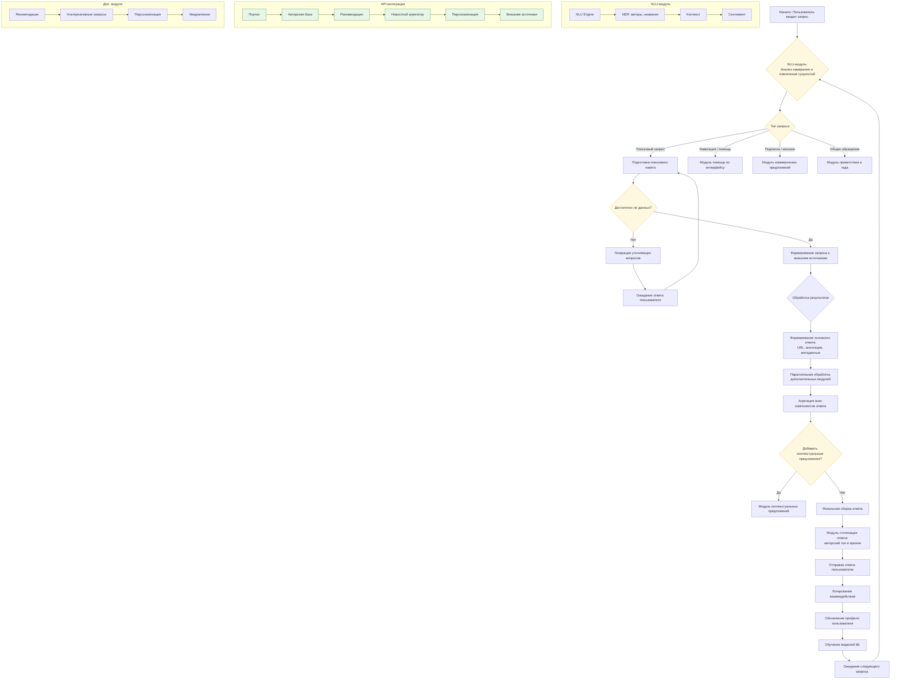

```mermaid
flowchart TD
    A[Начало: Пользователь вводит запрос] --> B{NLU-модуль:<br>Анализ намерения и извлечение сущностей}
    B --> C{Тип запроса}
    C -->|Поисковый запрос| D[Подготовка поискового пакета]
    C -->|Навигация / помощь| E[Модуль помощи по интерфейсу]
    C -->|Подписка / магазин| F[Модуль коммерческих предложений]
    C -->|Общее обращение| G[Модуль приветствия и гида]
    D --> H{Достаточно ли данных?}
    H -->|Нет| I[Генерация уточняющих вопросов]
    I --> J[Ожидание ответа пользователя]
    J --> D
    H -->|Да| K[Формирование запроса к внешним источникам]
    K --> L{Обработка результатов}
    L --> M[Формирование основного ответа:<br>URL, аннотации, метаданные]
    M --> N[Параллельная обработка дополнительных модулей]
    N --> O[Агрегация всех компонентов ответа]
    O --> P{Добавить контекстуальные предложения?}
    P -->|Да| Q[Модуль контекстуальных предложений]
    P -->|Нет| R[Финальная сборка ответа]
    R --> S[Модуль стилизации ответа:<br>авторский тон и ирония]
    S --> T[Отправка ответа пользователю]
    T --> U[Логирование взаимодействия]
    U --> V[Обновление профиля пользователя]
    V --> W[Обучение моделей ML]
    W --> X[Ожидание следующего запроса]
    X --> B
    
    %% Подсхемы (упрощённые для копирования)
    subgraph "NLU-модуль"
        B1[NLU Engine] --> B2[NER: авторы, названия] --> B3[Контекст] --> B4[Сентимент]
    end
    
    subgraph "API-интеграции"
        K1[Портал] --> K2[Авторская база] --> K3[Рекомендации] --> K4[Новостной агрегатор] --> K5[Персонализация] --> K6[Внешние источники]
    end
    
    subgraph "Доп. модули"
        N1[Рекомендации] --> N2[Альтернативные запросы] --> N3[Персонализация] --> N4[Уведомления]
    end
    
    %% Стили
    classDef decision fill:#fff8e1,stroke:#ff9800
    classDef api fill:#e8f5e9,stroke:#388e3c
    class B,C,H,P decision
    class K1,K2,K3,K4,K5,K6 api
```
